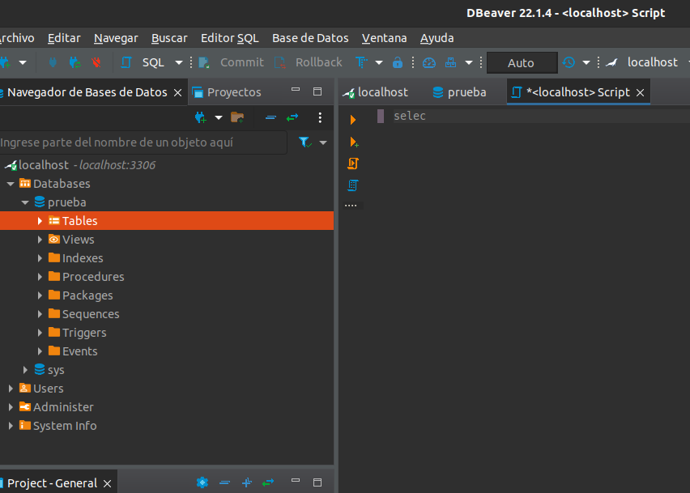
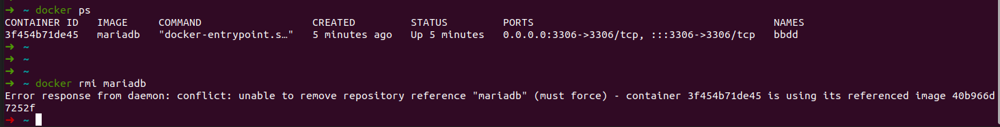

# Resolucion 


1. Pantallazo donde se vea la creación del contenedor y podamos comprobar que el contenedor está funcionando.

Para lograr la conexion se expuso el puerto 3306 en el host anfitrion con el siguiente comando:
```
docker run --name bbdd --env MARIADB_ROOT_PASSWORD=root --env MARIADB_DATABASE=prueba --env MARIADB_USER=invitado --env MARIADB_PASSWORD=invitado -p 3306:3306 mariadb
```



2.- Evidencia de la imposibilidad de eliminar la imagen mientras el contener que la utiliza esta corriendo.




