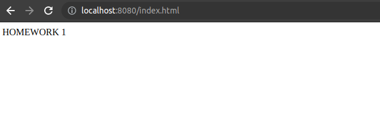
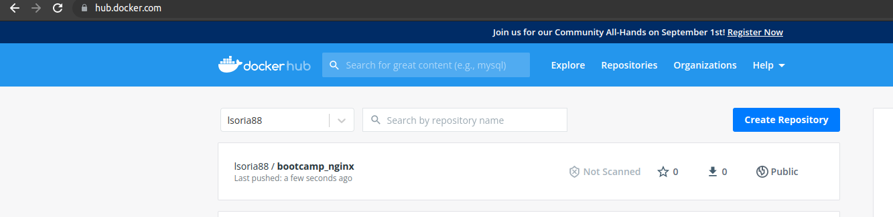

# Resolucion ejercicio 4

## Servicio nginx
A continuacion se evidencia que el servicio nginx se levanto correctamente en el localhost:8080

## Imagen en dockerhub
A continuacion evidencia de la imagen en mi dockerhub

