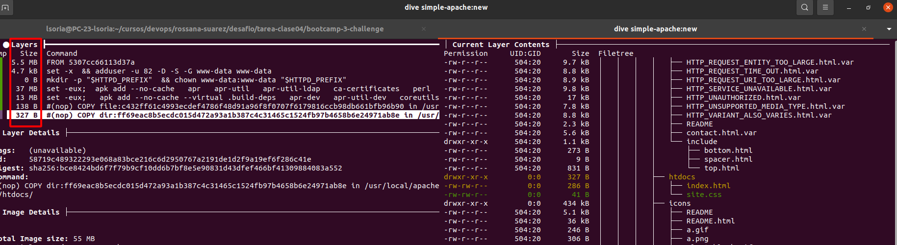

# Reto 4 

## Build iamgen httpd base
Se ejecuta el siguiente comando para crear la imagen base

```
docker build -t simple-apache:new .

```

## Run container
Con el siguiente comando se levanta el contenedor desde la imagen recientemente creada

```
docker run -dit --name my_apache -p 5050:80 simple-apache:new

```

# Evidencia de contenedor corriendo en mi local


# Evidencia de layer de la imagen
La imagen tiene 7 capas. La ultima capa es donde se copia el contenido de la carpeta content.

Si bien se puede visualizar con el comando "docker inspect <image_id>" la imagen es con el utilitario dive
https://github.com/wagoodman/dive




