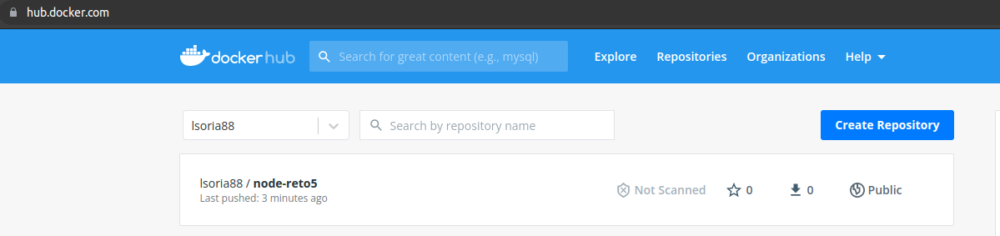

# Resolucion reto 5

# Inicio proyecto local
Para iniciar el proyecto de forma local se debe:
1.- instalar dependencias en este caso express

'''
npm i --save
'''

2.- Se verifica el comando para iniciar el proyecto desde el archivo package.json

'''
npm start
'''

# Dockerfile y se genera nueva imagen
```
docker build -t node-reto5:1.0.0 .
```
IMPORTANTE: El archivo package-lock.json hacia referencia en lockfileVersion=1, lo cual bloqueaba al uso de npm v5 y v6 y es bastante obsoleto e inseguro por lo que siendo que solo utilizaba express elimine el archivo para que pueda utilizar npm 8 que es la version hoy LTS.

# Iniciamos el contenedor
```
docker run -dit -p 8080:4000 --name reto5 node-reto5:1.0.0
```
# Subir imagen al docker registry personal
```
docker tag node-reto5:1.0.0 lsoria88/node-reto5:1.0.0
docker push lsoria88/node-reto5:1.0.0
```


# Automatizacion contenizacion proyecto Node JS
Para iniciar el proyecto rapidamente se debe establecer la version de la imagen ya generada o indicar la nueva version.

Finalmente ejecutar el siguiente script de inicializacion del proyecto dockerizado.

```
./run-container-project.sh
```


