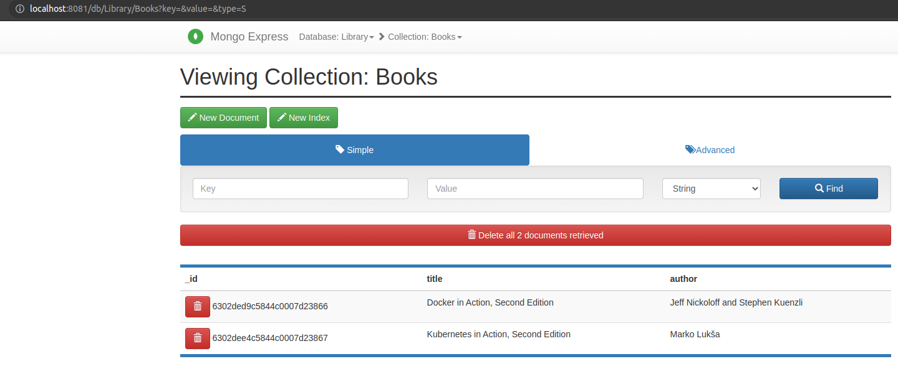
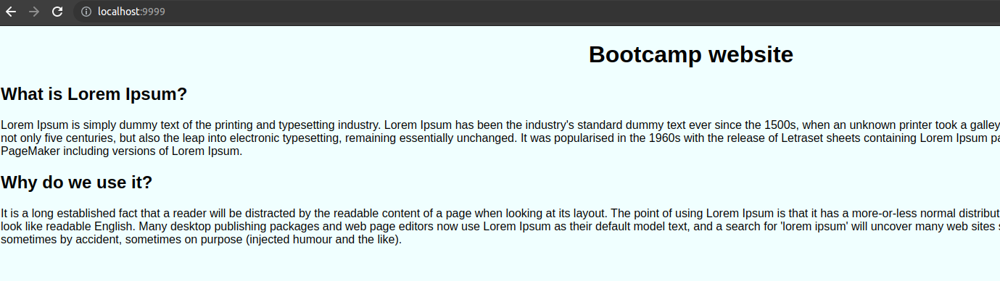

# Resolucion reto 6 bonus bootcamp DevOps
---

## MongoDB y Mongo-Express
Se debe ejecutar el docker-compose.yml dentro de la carpeta reto6-bonus que iniciara 2 contenedores, uno es el mongoDB y otro el cliente web mongo-express para visualizar via web los datos cargados del books.json



## Contenedor Nginx del proyecto bootcamp-web
Para iniciar el proyecto siendo que es solo codigo estatico se debe correr el siguiente comando:
```
docker run --name bootcamp-web -v ${PWD}:/usr/share/nginx/html:ro -p 9999:80 -d nginx
```




Para ejecutar el comando "ls" dentro del contenedor correr el siguiente comando

```
docker exec -it bootcamp-web ls
```
o tambien el siguiente comando
```
docker exec -it bootcamp-web sh -c 'ls'
```

## Stop all docker
Para esto se genero el siguiente script clean-docker.sh


