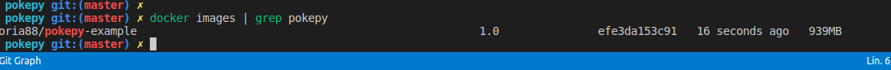

# Resolucion reto8-bonus

# Contener python flash
````
docker build -t lsoria88/pokepy-example:1.0 .
````


Correr un contener en base a la imagen anteriormente creada
````
docker run -itd --name pokepy -p 5000:5000 lsoria88/pokepy-example:1.0
````

A continuacion subo la imagen a mi docker registry
````
docker push lsoria88/pokepy-example:1.0
````

# Script mini CICD
Se genero el siguiente script como un mini proceso de CI/CD
````
chmod +x ./cicd.sh
./cicd.sh
````


